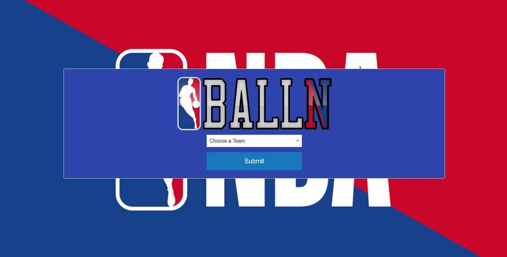
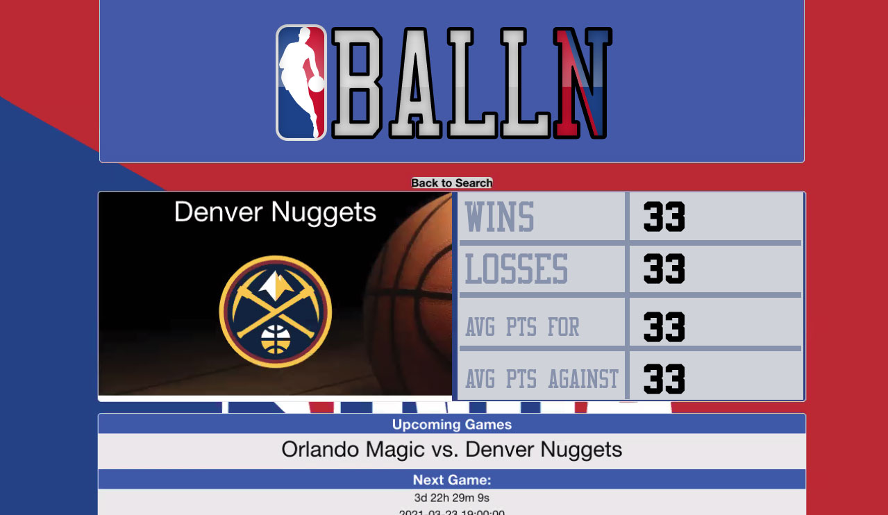

# PROJECT 01
## BALLN App
* [Live Link](https://stevenstefanov.github.io/nba-game-locator/)
* [Repo Link](https://github.com/stevenstefanov/nba-game-locator)

## Description
This is a sports app leveraging 2 APIs, the first being the NBA API which will retrieve game statistics for a team and the second API will retrieve the team's future games and ticket information. This will assist the user with getting their favorite NBA team's most updated stats and future games ticket information.

## Usage/Acceptance Criteria
The app will perfom the following logic:
* The app will display a dropdown which will display a list of all NBA teams.
* Once the user selects their team, the user will click on the Submit button.
* Upon hitting Submit, the app will store user selection in localStorage object and load a page displaying information about their team's stats, future dated games with ticketmaster link information.

## Basketball API Integration Steps

To successfully use application and pull API information, user must register at https://rapidapi.com/api-sports/api/api-basketball and obtain a personal API key. Insert the personal API key in these locations:
* index.js - line 35
* results.js - line 61

## Preview of App
* This is how the app looks

# License
* MIT